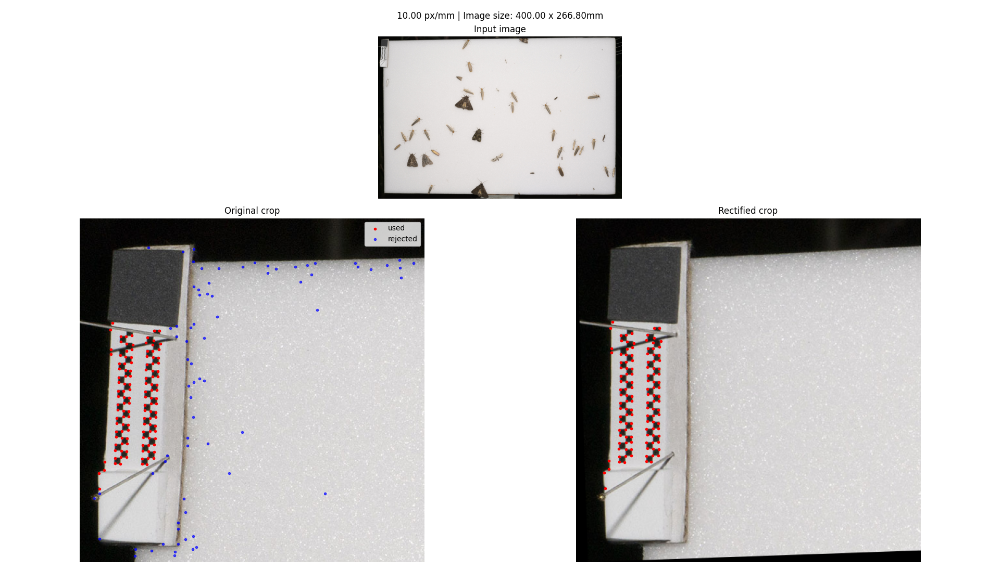

# scalebar - Processing tools for scale bars in images
*Author: Dimitri Korsch*

This package is meant to estimate the scale of a standardized scale bar in images captured by automatic light traps.
An example of the visualization output can be seen below.
The main function `scalebar.get_scale` outputs for a given image a float number representing the scale of the image in pixels per mm.
This scale can later be used to estimate the size of the objects, insects, or animals in the picture.



## Installation

*python >= 3.7 required. Tested on Ubuntu 18.04 and Python v3.9 so far*

### With `pip`

```bash
pip install scalebar
```

### From Source

```bash
git clone https://github.com/cvjena/scalebar
cd scalebar
# create a new environment, if you want (e.g. with conda create -n scalebar python~=3.9.0)
pip install -r requirements.txt
```

then either

```bash
make install
```

or

```bash
pip install .
```

or
```bash
python setup.py install
```

## Usage

### In your code

```python
import cv2
import scalebar

im = cv2.imread(path_to_your_image)
px_per_mm = scalebar.get_scale(im, pos=scalebar.Position.top_left)
# process the scale as you want
```

### From the console

```bash
python -m scalebar.estimate path/to/image.jpg
# outputs the scale to stdout
42.0
```

```bash
python -m scalebar.estimate path/to/image.jpg -o output.txt
# writes the scale to output.txt
```


```bash
# requires cvargparse, matplotlib, pyqt5
python -m scalebar.visualize path/to/image.jpg
# visualizes the estimation process
```

## Licence
This work is licensed under a [GNU Affero General Public License][agplv3].

[![AGPLv3][agplv3-image]][agplv3]

[agplv3]: https://www.gnu.org/licenses/agpl-3.0.html
[agplv3-image]: https://www.gnu.org/graphics/agplv3-88x31.png
